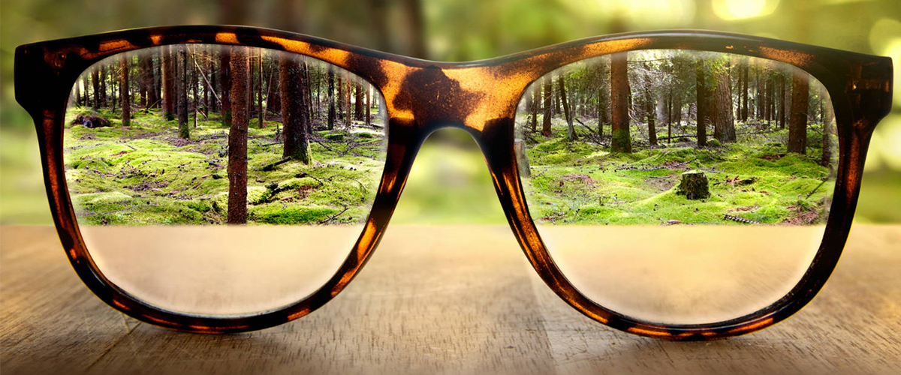
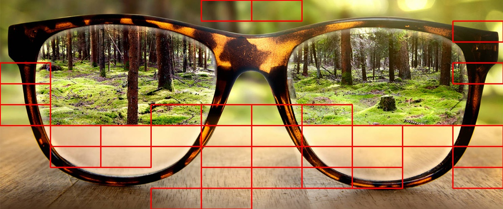
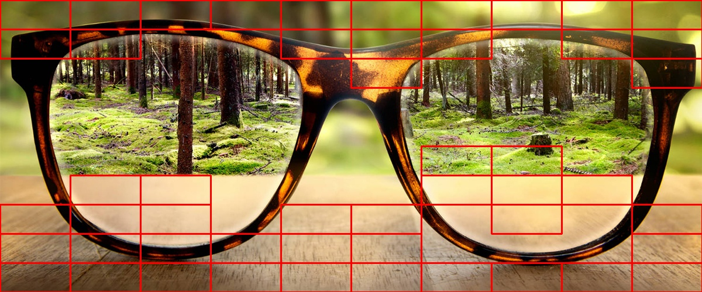

# Поиск размытого региона на изображении
Реализовать алгоритмы распознавания размытого изображения и региона

- Tenengrad (TENG)

- Normalized Gray Level Variance (GLVN)

- Sobel Variance (GLVN)

